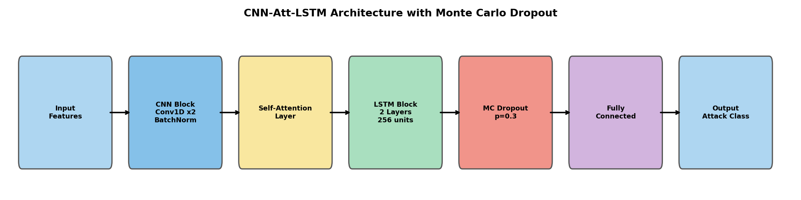
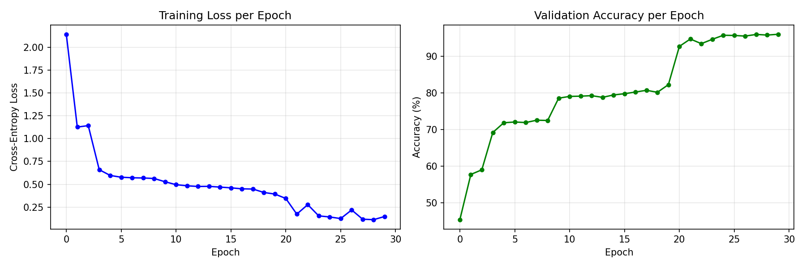
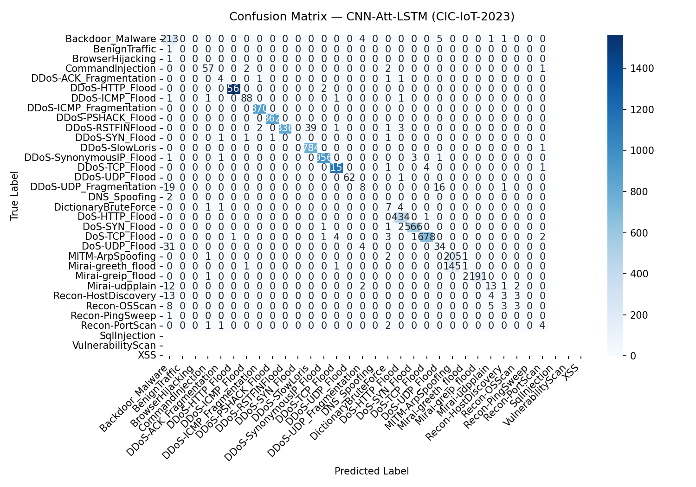
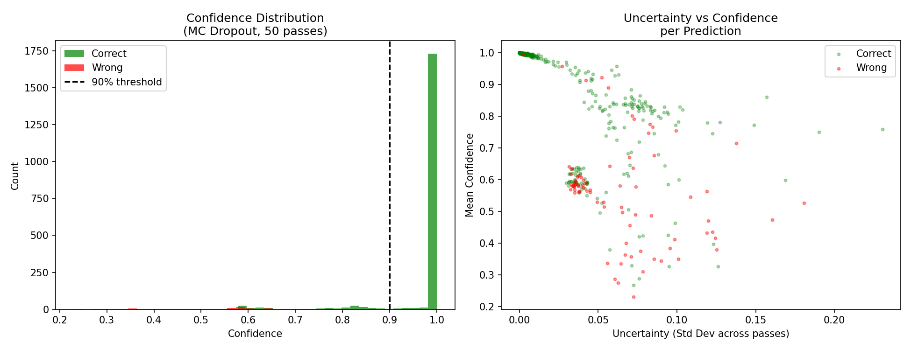

# CNN-Att-LSTM: Uncertainty-Aware IoT Intrusion Detection

An uncertainty-aware **CNN–Attention–LSTM** framework for IoT intrusion detection with cross-environment generalization, evaluated on **CIC-IoT-2023**, **N-BaIoT**, and **IoT-23**.

[](https://www.python.org/)
[](https://pytorch.org/)
[](LICENSE)

---

## Overview

Existing deep-learning IDS models for IoT share three limitations: they emit predictions without confidence estimates, they are trained on artificially balanced data, and they are rarely tested across different IoT environments. **CNN-Att-LSTM** addresses all three within a single architecture:

- **CNN** — spatial feature extraction from network-traffic features
- **Self-Attention** — adaptive weighting of the most discriminative features
- **LSTM** — temporal dependency modelling
- **Monte Carlo (MC) Dropout** — calibrated per-prediction confidence/uncertainty
- **ADASYN** — realistic class-imbalance handling

---

## Results

| Dataset | Setting | Accuracy | Precision | Recall | F1 |
|---|---|---|---|---|---|
| **CIC-IoT-2023** | 33-class | **96.01%** | 95.36% | 96.01% | 95.30% |
| **N-BaIoT** | cross-dataset (zero retraining) | **84.38%** | 85.87% | 84.38% | 77.39% |
| **IoT-23** | independent | **98.08%** | 98.08% | 98.08% | 98.08% |

**Uncertainty (MC Dropout, 50 passes):** MC accuracy 96.10% · mean confidence 95.7% · mean uncertainty 0.0093

---

## Figures

| | |
|---|---|
|  |  |
| **Architecture** | **Training curves** |
|  |  |
| **Confusion matrix (CIC-IoT-2023)** | **Uncertainty analysis** |

---

## Repository Structure

```
.
├── IDS_CNN_Att_LSTM.ipynb     # Full training & evaluation notebook (Google Colab)
├── paper.docx                 # Research manuscript
├── images/                    # All generated figures
│   ├── architecture_diagram.png
│   ├── training_curves.png
│   ├── confusion_matrix.png
│   ├── per_class_f1.png
│   ├── uncertainty_plot.png
│   ├── dataset_distribution.png
│   └── comparison_chart.png
├── requirements.txt
├── LICENSE
└── README.md
```

---

## How to Run

The notebook is designed for **Google Colab** with a free T4 GPU.

1. Open `IDS_CNN_Att_LSTM.ipynb` in [Google Colab](https://colab.research.google.com/)
2. Set **Runtime → Change runtime type → T4 GPU**
3. In the Kaggle setup cell, enter your Kaggle username and API key (datasets download automatically)
4. Run the cells top to bottom

### Datasets
- [CIC-IoT-2023](https://www.kaggle.com/datasets/akashdogra/ciciot23csv)
- [N-BaIoT](https://www.kaggle.com/datasets/mkashifn/nbaiot-dataset)
- [IoT-23](https://www.kaggle.com/datasets/agungpambudi/network-malware-detection-connection-analysis)


---

## License

Released under the [MIT License](LICENSE).
